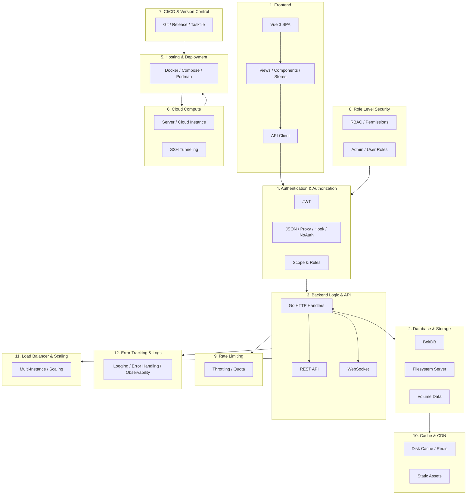

# ARCHITECTURE.md - System Architecture & Layer Guide

Dokumen ini adalah **Single Source of Truth** untuk arsitektur sistem **m0nskyFileManager**. Dokumen menjelaskan **12 lapisan (layer) arsitektur** yang menyusun seluruh program, cara setiap layer bekerja, bagaimana layer saling terhubung, serta menjadi **hub navigasi** menuju dokumentasi mendetail masing-masing layer di dalam folder `docs/layers/`.

> **Untuk Developer & AI Agent:** Saat melakukan *maintenance* atau menambahkan fitur, baca ringkasan layer di bawah ini, lalu ikuti tautan menuju dokumen layer terkait untuk panduan implementasi yang lebih spesifik.

---

## 1. Pendahuluan & Tujuan

### 1.1 Fungsi Dokumen
- Menjadi sumber rujukan utama (Single Source of Truth) arsitektur seluruh program.
- Menjelaskan **12 layer** yang menyusun sistem secara menyeluruh dan konsisten.
- Berperan sebagai **hub/navigator**: setiap layer dijelaskan ringkas di sini dan diarahkan ke dokumen khusus di `docs/layers/`.
- Memastikan developer & AI memiliki pemahaman yang sama sebelum melakukan *maintenance* atau penambahan fitur.

### 1.2 Cara Menggunakan Dokumen Ini
1. Baca `PRD.md` → pahami tujuan & logika bisnis.
2. Baca `ARCHITECTURE.md` ini → pahami struktur & layer terkait fitur yang dikerjakan.
3. Ikuti tautan ke `docs/layers/XX-*.md` → dapatkan panduan mendalam layer yang relevan.
4. Baca `STYLEGUIDE.md` → pastikan gaya penulisan kode sesuai standar m0nsky.

### 1.3 Hierarki Dokumentasi
```
PRD.md .................. Apa yang harus dibuat? (tujuan, fitur, target)
ARCHITECTURE.md ......... Di mana & Bagaimana? (12 layer arsitektur)
  └── docs/layers/*.md .. Panduan mendalam per layer
STYLEGUIDE.md ........... Bagaimana menulis kodenya? (standar & konvensi)
```

---

## 2. Diagram Arsitektur Keseluruhan

Diagram di bawah menampilkan 12 layer utama dan bagaimana layer tersebut saling terhubung dalam alur sistem end-to-end.



> Diagram di atas adalah representasi konseptual. Interaksi nyata antar-layer dijelaskan lebih lanjut pada setiap bagian layer di bawah dan pada dokumen layer terkait.

---

## 3. Peta 12 Layer Arsitektur

Setiap layer dijelaskan dengan: **definisi**, **tanggung jawab**, **komponen/teknologi**, **keterkaitan dengan modul kode nyata**, serta tautan ke dokumen layer terkait.

---

### Layer 1: Frontend
**Dokumen:** [`docs/layers/01-frontend.md`](layers/01-frontend.md)

**Definisi:** Lapisan antarmuka pengguna (User Interface) berbasis web. Seluruh interaksi pengguna terjadi pada layer ini dan diterjemahkan menjadi panggilan API ke backend.

**Tanggung Jawab:**
- Menampilkan file manager, editor, dashboard, dan halaman pengaturan.
- Mengelola state aplikasi dan navigasi (routing).
- Mengirim/menerima data dari backend via REST API & WebSocket.
- Internasionalisasi (i18n) multi-bahasa.

**Komponen & Teknologi:**
- **Vue 3** + TypeScript (SPA)
- **Pinia** (state management)
- **Vue Router** (navigasi & route guards untuk auth/admin)
- **Vue I18n** (multi-bahasa)
- **Vite** (build tooling)
- **tus-js-client** (resumable upload), **video.js**, **ace-builds** (editor), **qrcode.vue**, dll.

**Modul Kode Nyata:**
- Folder `frontend/` — `src/api`, `src/views`, `src/components`, `src/stores`, `src/router`, `src/i18n`.

**Catatan Roadmap:** View baru untuk **Podman Dashboard**, **Website Deployer**, dan **monitoring** akan ditambahkan pada layer ini.

---

### Layer 2: Database & Storage
**Dokumen:** [`docs/layers/02-database-storage.md`](layers/02-database-storage.md)

**Definisi:** Lapisan penyimpanan data persisten — baik data aplikasi (konfigurasi, user, share, settings) maupun berkas aktual di server.

**Tanggung Jawab:**
- Menyimpan data aplikasi (user, auth, settings, share links).
- Mengelola akses baca/tulis ke filesystem server sesuai scope user.
- (Roadmap) Mengelola volume Podman sebagai sumber data container.

**Komponen & Teknologi:**
- **BoltDB** — embedded key-value database, single-file (default `filebrowser.db`).
- **afero** — abstraksi filesystem.
- **ScopedFs** — filesystem ter-scope per user dengan proteksi symlink escape.
- (Roadmap) **Podman Volume**.

**Modul Kode Nyata:**
- `storage/` (+ `storage/bolt/`), `settings/`, `users/assets`, `share/`.

**Catatan Roadmap:** Dukungan **persistent volume Podman** (browse/backup/restore) akan ditambahkan pada layer ini.

---

### Layer 3: Backend Logic & API
**Dokumen:** [`docs/layers/03-backend-api.md`](layers/03-backend-api.md)

**Definisi:** Lapisan inti logika aplikasi yang mengekspos REST API & WebSocket untuk frontend, serta berinteraksi dengan database, filesystem, dan layanan eksternal (Podman).

**Tanggung Jawab:**
- Menangani request HTTP & meneruskan ke handler `Go`.
- Menyediakan CRUD resource, upload/download, search, share, settings, dsb.
- (Roadmap) Memproksi operasi Podman via **Podman REST API**.

**Komponen & Teknologi:**
- **Go** (Go 1.25)
- **Gorilla Mux** (router), **Gorilla WebSocket**
- **Cobra / Viper** (CLI & config)
- Routers & handlers pada package `http/`
- (Roadmap) **Podman REST API client** pada socket `/run/podman/podman.sock`

**Modul Kode Nyata:**
- `http/`, `cmd/`, `runner/`, `search/`, `rules/`, `files/`, `fileutils/`, `img/`, `diskcache/`.

**Catatan Roadmap:** Modul **Podman client/service** dan **deployer/wrapper** akan ditambahkan pada layer ini.

---

### Layer 4: Authentication & Authorization
**Dokumen:** [`docs/layers/04-auth-authz.md`](layers/04-auth-authz.md)

**Definisi:** Lapisan yang mengautentikasi identitas pengguna serta mengotorisasi akses terhadap resource berdasarkan scope, rules, dan permission.

**Tanggung Jawab:**
- Memverifikasi identitas (login/signup/renew session).
- Menerbitkan & memvalidasi **JWT**.
- Menegakkan **scope limit** dan **rule-based access control** (allow/deny per path).
- Menentukan permission per aksi (download, share, delete, etc.).

**Komponen & Teknologi:**
- **JWT** (`golang-jwt/jwt/v5`)
- 4 metode autentikasi: **JSON**, **Proxy**, **Hook**, **NoAuth**
- **bcrypt** (password hashing)
- **ReCaptcha** (opsional)
- **ScopedFs** + **rules**

**Modul Kode Nyata:**
- `auth/`, `http/auth.go`, `users/permissions.go`, `rules/`, `errors/`.

**Catatan Roadmap:** Dukungan autentikasi **SSH Key (Ed25519/RSA)** dan **session control (idle timeout)** akan diperkuat pada layer ini.

---

### Layer 5: Hosting & Deployment
**Dokumen:** [`docs/layers/05-hosting-deployment.md`](layers/05-hosting-deployment.md)

**Definisi:** Lapisan yang mengemas, mendistribusikan, dan menjalankan program pada server (containerization & runtime environment).

**Tanggung Jawab:**
- Membangun image aplikasi (backend Go + frontend Vue).
- Menjalankan aplikasi via container (Docker/Podman) atau binary langsung.
- Mengelola volume, port, dan environment di sisi deployment.
- (Roadmap) Menyediakan **Podman Wrapper** untuk deploy website pengguna.

**Komponen & Teknologi:**
- **Dockerfile** / **Dockerfile.s6** (multi-stage build)
- **compose.yaml** (Compose: app + Redis)
- **Taskfile.yml** (build automation)
- (Roadmap) **Podman**, **reverse proxy**, **Let's Encrypt**

**Modul Kode Nyata:**
- `Dockerfile`, `Dockerfile.s6`, `compose.yaml`, `docker/`.

**Catatan Roadmap:** Fitur **Podman Wrapper (Website Deployer)**, reverse proxy otomatis, dan **Auto-SSL** akan diwujudkan pada layer ini.

---

### Layer 6: Cloud Compute
**Dokumen:** [`docs/layers/06-cloud-compute.md`](layers/06-cloud-compute.md)

**Definisi:** Lapisan infrastruktur komputasi (server/instance) tempat aplikasi berjalan dan bagaimana akses aman dicapai (SSH tunneling).

**Tanggung Jawab:**
- Menyediakan lingkungan komputasi (CPU, memori, disk, network) untuk aplikasi.
- Memungkinkan akses aman ke private manager tanpa membuka port publik berisiko.
- Menjaga resource server agar tidak habis oleh satu pengguna.

**Komponen & Teknologi:**
- Server/cloud instance (VPS, dedicated, dsb.)
- **SSH Tunneling** (encrypted payload)
- **Rootless Podman** (isolation & keamanan maksimal)
- **Resource limit** (CPU & RAM) per container

**Modul Kode Nyata:**
- Terkait konfigurasi `cmd/root.go` (address, port, baseURL, TLS, socket).
- Dokumentasi deployment.

**Catatan Roadmap:** Integrasi SSH tunneling yang lebih dalam dan alokasi resource visual akan diharapkan pada layer ini.

---

### Layer 7: CI/CD & Version Control
**Dokumen:** [`docs/layers/07-cicd-vcs.md`](layers/07-cicd-vcs.md)

**Definisi:** Lapisan yang mengelola siklus pengembangan perangkat lunak — kontrol versi, otomatisasi build, test, dan release.

**Tanggung Jawab:**
- Mengelola riwayat kode via Git.
- Mengotomatisasi build frontend & backend.
- Mengelola versi & pembuatan release.
- Menjaga kualitas kode (linting, testing).

**Komponen & Teknologi:**
- **Git** & GitHub
- **Taskfile.yml** (build:frontend, build:backend, build, release)
- **.golangci.yml** (lint: gocritic, govet, revive)
- **.goreleaser.yml** (release automation)
- Test Go & Vitest (frontend)

**Modul Kode Nyata:**
- `Taskfile.yml`, `.golangci.yml`, `.goreleaser.yml`, `.gitignore`.

**Catatan Roadmap:** Pipeline CI/CD untuk build & deploy otomatis (termasuk integrasi Podman) akan diwujudkan pada layer ini.

---

### Layer 8: Role Level Security
**Dokumen:** [`docs/layers/08-role-security.md`](layers/08-role-security.md)

**Definisi:** Lapisan keamanan berbasis peran (RBAC) yang mengatur tingkat akses berbeda antara admin dan pengguna biasa.

**Tanggung Jawab:**
- Menentukan permission granular (Admin, Execute, Create, Rename, Modify, Delete, Share, Download).
- Membedakan hak akses admin vs non-admin pada frontend (route guards) dan backend.
- (Roadmap) Menentukan role untuk operasi Podman (mis. hanya admin yang boleh memanage container).

**Komponen & Teknologi:**
- **RBAC** via `users.Permissions`
- Route guard frontend (`requiresAdmin`)
- Otorisasi backend di setiap handler

**Modul Kode Nyata:**
- `users/permissions.go`, `frontend/src/router/index.ts`.

**Catatan Roadmap:** Perluasan RBAC untuk fitur Podman & deployment akan ditambahkan pada layer ini.

---

### Layer 9: Rate Limiting
**Dokumen:** [`docs/layers/09-rate-limiting.md`](layers/09-rate-limiting.md)

**Definisi:** Lapisan yang membatasi jumlah request dalam periode tertentu untuk melindungi server dari penyalahgunaan (abuse), brute force, atau overload.

**Tanggung Jawab:**
- Membatasi frekuensi request API.
- Melindungi endpoint sensitif (login, upload, dsb.) dari brute force.
- Menjaga stabilitas & ketersediaan layanan.

**Komponen & Teknologi:**
- Middleware rate limiting (belum diimplementasikan secara penuh — area pengembangan).
- Potensi integrasi dengan cache (Redis) untuk state rate limiting ter-distribusi.
- **ReCaptcha** (proteksi form login dari bot).

**Modul Kode Nyata:**
- Middleware di `http/` (perlu pengembangan).
- `auth/json.go` (ReCaptcha).

**Catatan Roadmap:** Implementasi rate limiting menyeluruh akan dikembangkan pada layer ini.

---

### Layer 10: Cache & CDN
**Dokumen:** [`docs/layers/10-cache-cdn.md`](layers/10-cache-cdn.md)

**Definisi:** Lapisan yang mempercepat penyajian data dan aset melalui caching lokal/ter-distribusi dan penyajian aset statis.

**Tanggung Jawab:**
- Menyimpan cache thumbnail/preview agar tidak dihitung ulang.
- Mendukung cache ter-distribusi antar-instance (Redis).
- Menyajikan aset statis frontend secara efisien.

**Komponen & Teknologi:**
- **diskcache** (`diskcache/`) — disk/memory cache, implement `Interface`.
- **Redis** (upload cache multi-instance via `compose.yaml`).
- Static assets dari `frontend/assets.go` (embedded ke binary Go).
- **HTTP cache headers** / ETag.

**Modul Kode Nyata:**
- `diskcache/`, `http/upload_cache_memory.go`, `http/upload_cache_redis.go`, `frontend/assets.go`.

**Catatan Roadmap:** Integrasi CDN untuk aset statis dan caching Podman data akan dievaluasi pada layer ini.

---

### Layer 11: Load Balancer & Scaling
**Dokumen:** [`docs/layers/11-loadbalancer-scaling.md`](layers/11-loadbalancer-scaling.md)

**Definisi:** Lapisan yang menangani distribusi beban dan penskalaan aplikasi seiring bertambahnya pengguna/beban.

**Tanggung Jawab:**
- Mendistribusikan request ke beberapa instance aplikasi.
- Menyinkronkan state antar-instance (terutama cache & session).
- (Roadmap) Mendukung horizontal scaling pada beban tinggi.

**Komponen & Teknologi:**
- Reverse proxy / load balancer (nginx, traefik, dsb.).
- **Redis** untuk state ter-distribusi (cache/upload cache).
- Stateless design pada aplikasi Go (state di BoltDB + Redis).

**Modul Kode Nyata:**
- `http/`, `diskcache/`, `compose.yaml` (Redis).

**Catatan Roadmap:** Arsitektur scaling penuh (multi-instance, session affinity, dsb.) akan dikembangkan pada layer ini.

---

### Layer 12: Error Tracking & Logs
**Dokumen:** [`docs/layers/12-error-tracking-logs.md`](layers/12-error-tracking-logs.md)

**Definisi:** Lapisan observability yang menangkap, mencatat, dan menganalisis error serta log aplikasi untuk pemantauan & debugging.

**Tanggung Jawab:**
- Mencatat log request, error, dan event aplikasi.
- Menangani error secara konsisten (status code & pesan terstruktur).
- Rotasi & penyimpanan log yang aman.
- (Roadmap) Audit log untuk riwayat aksi (action history) & backup.

**Komponen & Teknologi:**
- **log** (Go standard library)
- **lumberjack** (log rotation — `cmd/root.go`)
- Tipe error terpusat di `errors/`
- Peta status → error message (`errToStatus`)

**Modul Kode Nyata:**
- `errors/`, `cmd/root.go` (setupLog), seluruh handler `http/`.

**Catatan Roadmap:** Fitur **audit log (action history)** dan **error tracking** yang lebih komprehensif (structured logging, trace ID) akan dikembangkan pada layer ini.

---

## 4. Interaksi Antar-Layer & Konvensi

### 4.1 Alur Request Umum
```
Browser (Layer 1)
  → HTTPS/WebSocket
  → Load Balancer (Layer 11, opsional)
  → Rate Limiting (Layer 9)
  → Auth & Authz (Layer 4)
  → Backend Handler (Layer 3)
  → Database/Storage (Layer 2) | Cache (Layer 10) | Podman (Roadmap)
  → Error & Logs (Layer 12)
```

### 4.2 Konvensi Penamaan Dokumen Layer
File dokumen yang akan dibuat di `docs/layers/` menggunakan format **`NN-nama-layer.md`** dengan nomor urut sesuai daftar 12 layer:

| File | Layer |
|---|---|
| `01-frontend.md` | Frontend |
| `02-database-storage.md` | Database & Storage |
| `03-backend-api.md` | Backend Logic & API |
| `04-auth-authz.md` | Authentication & Authorization |
| `05-hosting-deployment.md` | Hosting & Deployment |
| `06-cloud-compute.md` | Cloud Compute |
| `07-cicd-vcs.md` | CI/CD & Version Control |
| `08-role-security.md` | Role Level Security |
| `09-rate-limiting.md` | Rate Limiting |
| `10-cache-cdn.md` | Cache & CDN |
| `11-loadbalancer-scaling.md` | Load Balancer & Scaling |
| `12-error-tracking-logs.md` | Error Tracking & Logs |

### 4.3 Prinsip Arsitektur
1. **Consistency** — Jangan menyimpang dari struktur yang telah ditetapkan di sini dan di `STYLEGUIDE.md`.
2. **Security by default** — Semua layer harus menerapkan prinsip least privilege & isolation (rootless, scoped, role-based).
3. **Stateless backend** — State disimpan di database (BoltDB) & cache (Redis) agar mudah diskala.
4. **Observability** — Setiap fitur baru harus memiliki log & penanganan error yang jelas.

---

## 5. Status Roadmap

| Area | Status |
|---|---|
| File manager web (Layer 1–4, 8, 10, 12) | **Sudah ada (nyata)** |
| Hosting via Docker/Compose (Layer 5) | **Sudah ada (nyata)** |
| CI/CD tooling (Layer 7) | **Sebagian (Taskfile, goreleaser)** |
| Cache Redis multi-instance (Layer 10) | **Sudah ada (nyata)** |
| **Podman Integration** (Layer 2, 3, 5) | **Roadmap** |
| **Podman Wrapper / Website Deployer** (Layer 5) | **Roadmap** |
| **SSH Tunneling Advance** (Layer 6) | **Roadmap** |
| **Rate Limiting menyeluruh** (Layer 9) | **Roadmap** |
| **Load Balancer & Scaling** (Layer 11) | **Roadmap** |
| **Audit Log & Error Tracking komprehensif** (Layer 12) | **Roadmap** |

---

## 6. Referensi

- [`PRD.md`](PRD.md) — Product Requirements Document
- [`STYLEGUIDE.md`](STYLEGUIDE.md) — Panduan standar penulisan kode
- [`AGENTS.md`](AGENTS.md) — Instruksi & workflow AI Agent
- `docs/layers/` — Dokumentasi mendetail per layer (dibuat bertahap)
- `README.md` — Ringkasan proyek
